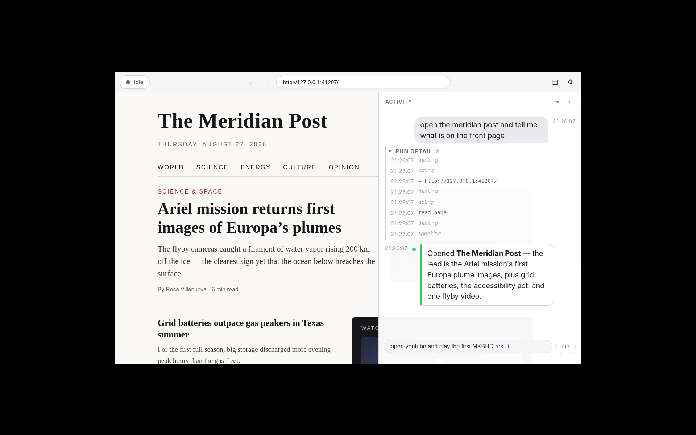

# Bing Bong

A voice-first assistant: a local voice pipeline (wake word, STT, TTS) drives
LLM agents (GLM-4.6 orchestrator, DeepSeek subagents) operating a real
embedded Chromium via CDP — every web read and write happens in a visible
tab, on a live dashboard.



## What it does

- **Talk or type.** `Ctrl/Cmd+Space` arms listening; say "bing bong" for
  hands-free. "stop now" cancels a run, "hold on" pauses it for a spoken
  steering instruction, and the wake word mid-answer barges in — playback
  stops instantly and it listens again.
- **Browses for real.** The agents drive the embedded browser: navigate,
  read, type, click, download. Search is GUI search (ADR 0009) — nothing
  happens through an invisible API.
- **Answers out loud.** Each command gets a spoken one-liner plus full
  detail in the transcript. STT streams partial transcripts while you talk;
  TTS is local Piper.
- **Risk gate.** Every click/type is classified from snapshot facts
  collected in-page. Form submissions and downloads pause for a spoken +
  on-screen confirmation (auto-deny after 60 s); credential fills and
  payment submissions are hard-denied in code — no confirmation, no
  override.
- **Handles the annoying web.** Cookie/consent walls are auto-dismissed;
  other DOM dialogs expose their text and controls to the model; native JS
  dialogs are auto-dismissed and reported; `window.open` popups are closed
  with their URL reported; covered clicks report the overlay instead of
  silently clicking through it. `ask_user` shows and speaks a free-text
  question and accepts a typed or spoken answer (~45 s window).
- **Media and downloads.** `media_control` drives playback on the focused
  page via injected YouTube-style shortcuts — pause, volume, next, seek;
  never ad-skipping. Approved downloads land in
  `~/Downloads/bingbong_downloads/`; the filename is spoken and displayed.
- **Ships as an appliance.** The full loop — voice, screen, models — runs
  from one Docker Compose command on a kiosk.

## Quickstart

Linux, Node ≥ 22.18, pnpm.

```sh
pnpm install    # native dep: onnxruntime-node; with gcc ≥ 14 export
                #   CFLAGS=-D_GNU_SOURCE CXXFLAGS=-D_GNU_SOURCE first
export ZAI_API_KEY=… BINGBONG_ORCHESTRATOR_BASE_URL=https://ai.z.ai/api/coding/paas/v4 BINGBONG_ORCHESTRATOR_MODEL=glm-5.3-flash
pnpm dev
```

Type `open youtube and play the first MKBHD result` into the command box —
or arm listening with `Ctrl/Cmd+Space` and say it — and watch the loop
navigate, read, type, and click. Voice needs one manual model download
(Silero VAD); everything else fetches itself.

## Voice models

The first voice command needs the Silero VAD model in `<userData>/models`
(`~/.config/bingbong/models` on Linux — set `BINGBONG_VAD_MODEL` to
override):

```sh
mkdir -p ~/.config/bingbong/models
curl -L -o ~/.config/bingbong/models/silero_vad.onnx \
  https://github.com/snakers4/silero-vad/raw/master/src/silero_vad/data/silero_vad.onnx
```

Everything else is app-managed:

- **Moonshine STT** (Small by default; Base and Medium selectable on the
  settings page) — the int8 ONNX export (~230 MB) fetches in the background
  on first launch; a fetch failure surfaces as an STT error on the first
  spoken command, not a startup crash.
- **Wake models** — three custom heads run fully in Node via
  onnxruntime-node (melspectrogram → speech embedding → one classifier per
  head): "bing bong" wakes, "stop now" aborts, "hold on" pauses. Silero VAD
  gates the scores against music/noise false positives; the settings-page
  threshold slider applies live. Download links and the parity write-up:
  `docs/wake-parity.md`.

The wake engine has a Python fallback (`pip install openwakeword
onnxruntime`) — a pure config swap; the seam (`WakeWordDetector`) and the
VAD gate above it are identical for both engines.

## Model routing

Routing is env-only — no model ids are hardcoded. Per role
(`ORCHESTRATOR`, `SUBAGENT`, `VISION`), any OpenAI-compatible provider:

```sh
BINGBONG_ORCHESTRATOR_BASE_URL   # e.g. https://ai.z.ai/api/coding/paas/v4 (z.ai coding plan)
BINGBONG_ORCHESTRATOR_MODEL      # e.g. glm-5.3-flash
BINGBONG_ORCHESTRATOR_API_KEY    # or rely on the default key env (ZAI_API_KEY for
                                 # orchestrator/vision, DEEPSEEK_API_KEY for subagent),
                                 # or point elsewhere with BINGBONG_ORCHESTRATOR_API_KEY_ENV
```

Routing and keys may also live in the `.env` file next to the app (read
once at boot; malformed lines are ignored). Precedence is
`.env` < process environment < the settings page's saved values — a value
set anywhere above never gets overridden. The settings page's Model routing
section shows each role configured/unconfigured from the same resolution
the pipeline uses.

Session-continuity budgets are configurable per orchestrator model.
Journal and Working Memory values are estimated tokens and must satisfy
`high < reserve < hard`; a `"*"` profile is the fallback when routing
changes:

```sh
BINGBONG_CONTINUITY_BUDGETS='{"glm-5.3-flash":{"journal":{"high":2400,"reserve":2700,"hard":3000},"memory":{"high":4800,"reserve":5400,"hard":6000}},"*":{"journal":{"high":2400,"reserve":2700,"hard":3000},"memory":{"high":4800,"reserve":5400,"hard":6000}}}'
```

### Environment variables

```sh
BINGBONG_ENV_FILE=…                    # load .env from another path
BINGBONG_ASK_TIMEOUT_MS=…              # ask_user window (default ~45 s)
BINGBONG_REASONING_EFFORT=low|high|max # force every round's reasoning rung; unset,
                                       # the Effort Tier decides (Lookup high, Investigation max)

# Wake
BINGBONG_WAKE_ENGINE=node|python|off   # default node; python = reference sidecar (wake head only)
BINGBONG_WAKE_MODEL=…                  # override the "bing bong" head path
BINGBONG_WAKE_ABORT_MODEL=…            # override the "abort" head path
BINGBONG_WAKE_HOLD_ON_MODEL=…          # override the "hold on" head path

# Diagnostics
BINGBONG_BROWSER_SUBSPANS=1            # verbose sub-spans inside browser actions (perf log)
BINGBONG_AUDIO_DUMP=1                  # dump each utterance as a WAV for offline STT A/B

# Scripted doubles — replace the real engines; used by the e2e suite and
# keyless demos
BINGBONG_LLM_SCRIPT='[…]'              # orchestrator turns (JSON array)
BINGBONG_VAD_SCRIPT='[0.01, 0.99]'     # VAD probabilities
BINGBONG_STT_SCRIPT='["…"]'            # transcripts
BINGBONG_WAKE_SCRIPT='[0.01, 0.99]'    # wake scores (object form scripts each head)
```

## Kiosk deployment

The appliance ships as a container (ADR 0023) — full voice loop, real
screen, one command, no downloads on the kiosk:

```sh
cp .env.example config/.env   # fill model routing + keys
scripts/kiosk-setup.sh        # diagnose-only preflight
docker compose up --build -d
```

Run it inside the kiosk's X session (`xhost +local:` grants the container
access to the screen). X11 and the PulseAudio socket are passed through, so
the dashboard renders on the physical screen and mic/speakers work
unchanged. Every model — Silero VAD, openWakeWord, the custom wake heads,
Moonshine Small, the Piper voice — is baked into the image and seeded into
`./data` on first boot. All durable state (Browser Profile, Settings,
history, downloads) lives in `./data`: delete it for a fresh start, copy it
to migrate.

## Observability

Every turn is perf-logged, zero config: one JSONL span per finished stage
(STT, each LLM round, each tool call, TTS), keyed by a `turnId` shared with
the event stream and history, written to a rotating `logs/` dir under the
profile. `pnpm perf:report` aggregates per-stage latency percentiles;
`BINGBONG_BROWSER_SUBSPANS=1` drills into browser actions; see
`docs/stt-latency.md` and `docs/moonshine-ab.md` for measured results.

`BINGBONG_AUDIO_DUMP=1` writes every detected utterance to `audio-dumps/`
under the profile as a 16 kHz mono WAV — the artifact shape offline STT
benchmarks replay. Replay them against the shipped engine (transcripts +
endpoint→transcript p50/p95) with `pnpm stt:replay`.

## Architecture

Everything is tested through one boundary: a text command goes in, a typed
event stream comes out (`src/core/pipeline`). The stream covers status
transitions, tool calls/results, confirmation and free-text ask requests
and resolutions, speak/display payloads, and errors.

- **Above the seam** (thin adapters): voice pipeline, dashboard UI.
- **Below the seam** (interfaces + test doubles, `src/core/ports`): LLM
  client, browser controller, TTS, STT, search, clock (injectable for
  timeout tests). Scripted doubles resolve env-side in the main adapters
  (`BINGBONG_*_SCRIPT`); pure doubles for unit tests live in
  `src/core/testing`.

```
src/
  main/        Electron main process
    agent/     model-routed OpenAI client, orchestrator prompt, pipeline glue, IPC
    voice/     Silero VAD adapter, scripted doubles, voice IPC
    moonshine/ streaming Moonshine STT engine + model fetch
  preload/     contextBridge preload
  renderer/    React dashboard (command box, transcript, status orb, browser pane, mic worklet)
  core/
    agent/     model routing config + the answer contract (speak/display)
    pipeline/  command pipeline + event types (the seam)
    ports/     interfaces for LLM, browser, TTS, STT, search, clock
    voice/     VAD endpointing, yes/no parsing, voice session (the ears' seam)
    testing/   test doubles (scripted LLM, fake clock, fakes)
```

Domain language and architectural decisions: `CONTEXT.md`, `docs/adr/`.

## Development

```sh
pnpm dev        # launch the app in dev mode
pnpm test       # run the test suite
pnpm test:e2e   # e2e suite (wraps vitest in Xvfb — never against a real display)
pnpm test:eval  # opt-in real-model evaluation (#109) — spends model budget, freezes a
                # baseline with BINGBONG_EVAL_REPORT=e2e/eval/baseline.json pnpm test:eval
pnpm typecheck  # tsc over main/preload/core + renderer
pnpm lint       # eslint
pnpm build      # production build to out/
pnpm perf:report  # per-stage latency percentiles from the rotating perf log
pnpm stt:replay   # replay utterance dumps through the shipped STT engine
pnpm shot         # regenerate docs/screenshot.png (launches the app under Xvfb)
```
